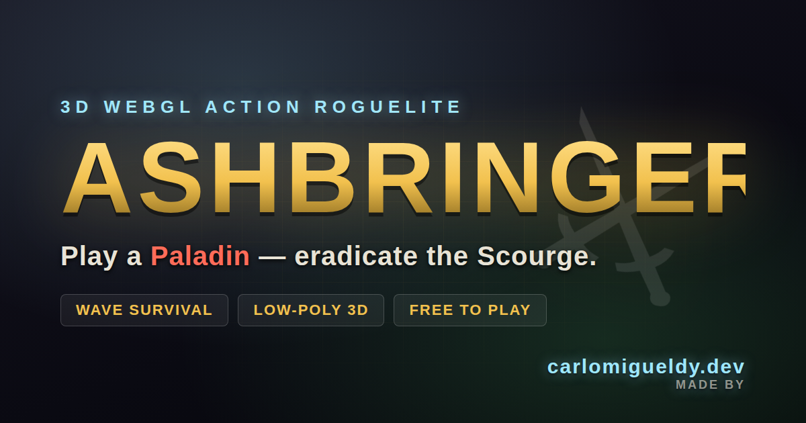

# Ashbringer

**Ashbringer** is a free, browser-based 3D WebGL action roguelite where you play as a holy Paladin eradicating endless waves of the undead Scourge in a stylized low-poly world.

Play instantly: **https://ashbringer.carlomigueldy.dev**

Created by **[carlomigueldy.dev](https://carlomigueldy.dev)**.



## Overview

Ashbringer is an HTML5 game built with **Three.js** and modern browser APIs. It runs without a build step and focuses on fast, shareable browser gameplay: movement, melee combat, holy abilities, wave survival, score chasing, level-ups, upgrades, procedural audio, and social-friendly SEO metadata.

You stand alone as a Paladin in a ruined low-poly arena. The Scourge rises from the corrupted ground in escalating waves: ghouls, skeletons, abominations, necromancers, and boss encounters. Survive, level up, choose blessings, chain combos, and push your score higher each run.

## Features

- **3D low-poly WebGL world** rendered with Three.js
- **Paladin action combat** with directional melee attacks and holy abilities
- **Wave survival gameplay** with scaling enemy difficulty
- **Multiple enemy archetypes** including ghouls, skeletons, abominations, necromancers, and Lich Lord boss waves
- **Roguelite progression** with XP, levels, and upgrade choices
- **Score and combo system** for replayability
- **Holy abilities** including Smite, Holy Nova, Consecrate, and Dash
- **Procedural WebAudio sound effects and ambient music** with no external audio assets
- **Particle effects, camera shake, damage numbers, and visual feedback**
- **Responsive browser play** with keyboard, mouse, and basic touch support
- **SEO and social sharing support** with Open Graph, Twitter cards, sitemap, robots.txt, favicon, and structured data
- **Persistent attribution** to [carlomigueldy.dev](https://carlomigueldy.dev)

## Play

Open the live game in any modern desktop browser:

```text
https://ashbringer.carlomigueldy.dev
```

Fallback Vercel URL:

```text
https://ashbringer.vercel.app
```

For best results, use Chrome, Edge, Firefox, or Safari with WebGL enabled.

## Controls

| Action | Input |
| --- | --- |
| Move | `W` `A` `S` `D` or arrow keys |
| Aim | Mouse |
| Smite | Left mouse button |
| Holy Nova | `Space` |
| Consecrate | Right mouse button or `Q` |
| Holy Dash | `Shift` |
| Mute audio | `M` |
| Pause | `P` |

## Gameplay Loop

1. Start a run as the Paladin.
2. Survive waves of Scourge enemies.
3. Defeat enemies to earn XP, score, and combo multipliers.
4. Level up and choose divine blessings.
5. Use movement, positioning, Smite, Holy Nova, Consecrate, and Dash to survive.
6. Fight increasingly dangerous waves and boss encounters.
7. Chase a higher score and best run.

## Abilities

### Smite

A fast directional melee attack. Aim with the mouse and strike enemies in front of the Paladin. Upgrades can improve Smite damage, attack speed, range, crit chance, and lifesteal.

### Holy Nova

A radial burst of holy damage that knocks enemies back and helps recover space when surrounded.

### Consecrate

Places a holy ground effect at the aim point, damaging Scourge enemies standing inside it over time.

### Holy Dash

A short burst of movement with brief invulnerability. Use it to escape swarms, reposition, or dodge projectiles.

## Enemies

| Enemy | Role |
| --- | --- |
| Ghoul | Basic melee chaser |
| Skeleton | Fast melee attacker |
| Abomination | Slow, durable heavy enemy |
| Necromancer | Ranged summoner and projectile caster |
| Lich Lord | Boss enemy with summons and ranged attacks |

## Upgrades

Leveling up presents a choice of blessings. Example upgrade themes include:

- More Smite damage
- Faster attack speed
- Higher movement speed
- More max HP
- Better crit chance
- Lifesteal
- Armor
- Faith regeneration
- Stronger Holy Nova
- Stronger Consecrate
- Improved Dash
- Reflective holy damage

## Tech Stack

- **HTML5**
- **CSS3**
- **JavaScript ES Modules**
- **Three.js** for WebGL rendering
- **WebAudio API** for procedural audio
- **Vercel** for hosting and production deployment
- **GitHub** for source control

## Project Structure

```text
.
├── index.html          # Main HTML, game shell, SEO metadata, import map
├── favicon.svg         # Browser/social icon
├── og-image.png        # Facebook/Open Graph/Twitter share image
├── robots.txt          # Crawler rules and sitemap pointer
├── sitemap.xml         # Canonical sitemap
├── vercel.json         # Vercel deployment configuration
└── src/
    ├── audio.js        # Procedural WebAudio music and sound effects
    ├── enemies.js      # Enemy archetypes, models, and AI
    ├── game.js         # Main game loop and orchestration
    ├── main.js         # Entry point
    ├── particles.js    # Particle system
    ├── player.js       # Paladin model, movement, and abilities
    ├── projectiles.js  # Enemy projectiles, pickups, and consecration
    ├── style.css       # HUD, overlays, responsive UI, attribution styling
    ├── ui.js           # DOM HUD, screens, and damage numbers
    ├── upgrades.js     # Level-up blessings and upgrade logic
    ├── utils.js        # Shared helpers and constants
    └── world.js        # Low-poly arena, props, lighting, and fog
```

## Local Development

This project has no build step. Serve the repository with any static web server.

Using Python:

```bash
python3 -m http.server 5173
```

Then open:

```text
http://127.0.0.1:5173/
```

Do not use `file://` directly because browser module loading and import maps are designed to run from an HTTP server.

## Deployment

The game is deployed on Vercel.

Production URL:

```text
https://ashbringer.carlomigueldy.dev
```

Fallback Vercel URL:

```text
https://ashbringer.vercel.app
```

The GitHub repository is connected to Vercel, so pushes to `main` trigger production deployments.

## SEO and Social Sharing

Ashbringer includes share-friendly metadata for search engines and social platforms:

- Descriptive `<title>` and meta description
- Self-referencing canonical URL
- Open Graph tags for Facebook and link previews
- Twitter/X summary large image card
- 1200×630 PNG social preview image
- `VideoGame` JSON-LD structured data
- `robots.txt`
- `sitemap.xml`
- SVG favicon
- Explicit creator and attribution links to [carlomigueldy.dev](https://carlomigueldy.dev)

Primary canonical URL:

```text
https://ashbringer.carlomigueldy.dev/
```

Open Graph image:

```text
https://ashbringer.carlomigueldy.dev/og-image.png
```

## Attribution

Made by **[carlomigueldy.dev](https://carlomigueldy.dev)**.

The attribution is intentionally included in:

- The start screen
- The persistent in-game credit badge
- SEO meta description
- Open Graph description and image alt text
- Structured data author and creator fields
- This README

## Repository About Description

Suggested GitHub repository description:

```text
Free 3D low-poly WebGL action roguelite: play a Paladin eradicating the undead Scourge. Built with Three.js. Made by carlomigueldy.dev.
```

Suggested website:

```text
https://ashbringer.carlomigueldy.dev
```

## Browser Support

Ashbringer targets modern browsers with support for:

- WebGL
- ES modules
- Import maps
- WebAudio API
- Local storage

If the game fails to load, confirm that WebGL is enabled and that the game is being served over HTTP/HTTPS.

## Performance Notes

The game uses low-poly geometry, flat-shaded materials, instanced particles, and procedural assets to keep the experience lightweight and asset-free. Most visuals are generated directly in code.

## License

No license has been specified yet. Until a license is added, all rights are reserved by the author.

## Author

**carlomigueldy.dev**

- Website: https://carlomigueldy.dev
- Game: https://ashbringer.carlomigueldy.dev
- Repository: https://github.com/carlomigueldy/ashbringer
